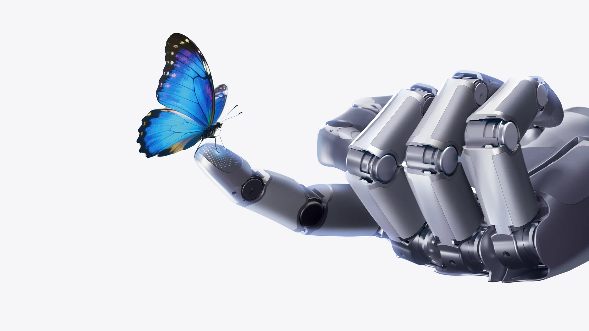
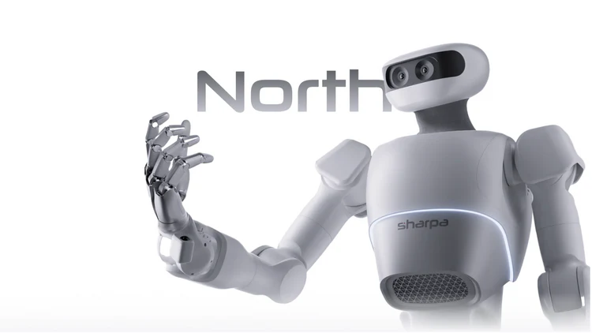
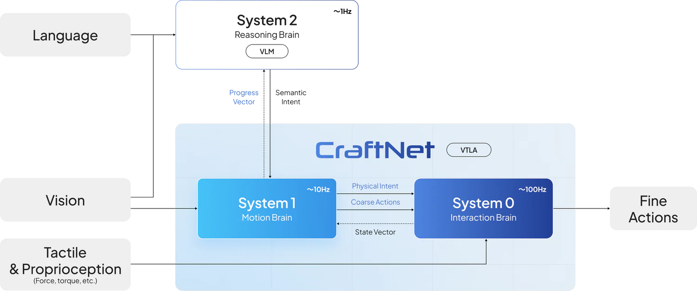

    <picture>
        <source media="(prefers-color-scheme: dark)" srcset="../images/logo-light.svg">
        <source media="(prefers-color-scheme: light)" srcset="../images/logo-dark.svg">
        
    </picture>

### Manufacture Time by Making Robots Useful

### 🚀 About Sharpa

---

Sharpa is an AI robotics company building ultra-high performance robots and core components to unlock the limitless possibilities of future general-purpose robots.

 builds robots not to replace people, but to help. When robots take on repetitive, strenuous tasks, people can step away and pursue more meaningful endeavors.
More time is deposited into everyone’s time bank. We give time back to humans.

### 🤖 Products & Technology

---

<table>
  <tr>
    <td width="50%" align="center">
      
    </td>
    <td align="center" valign="middle" style="padding-bottom: 32px">
      <h3>
        <a href="https://www.sharpa.com/pages/wave">Wave</a>
      </h3>
      
A revolutionary dexterous robotic hand designed to match the
human hand in size, structure, and tactile sensitivity.

    </td>
  </tr>
  <tr>
    <td width="50%" align="center">
      
    </td>
    <td align="center" valign="middle" style="padding-bottom: 32px">
      <h3>
        <a href="https://www.sharpa.com/pages/north">North</a>
      </h3>
      
A full-body robot integrates high dynamic,
smooth whole-body control, and fine loco-manipulation.

    </td>
  </tr>
  <tr>
    <td width="50%" align="center">
      
    </td>
    <td align="center" valign="middle" style="padding-bottom: 32px">
      <h3>
        <a href="https://www.sharpa.com/pages/craftnet">CraftNet</a>
      </h3>
      
An end-to-end, hierarchical VTLA model for fine manipulation, enabling native, anthropomorphic last-millimeter interaction.

    </td>
  </tr>
</table>

### 📂 Downloads

---

<table>
  <tr>
    <td rowspan="2" width="120" align="center" valign="middle"><b>Device Software</b></td>
    <td>
      
    </td>
    <td>Sharpa Pilot is the official application for device configuration, monitoring, firmware updates, and routine operations.</td>
  </tr>
  <tr>
    <td>
      
    </td>
    <td>Sharpa Wave firmware is the embedded software on Sharpa Wave that runs low-level control, sensing, and host communication for use with Sharpa Pilot and Sharpa Wave SDK.</td>
  </tr>
  <tr>
    <td rowspan="2" width="120" align="center" valign="middle"><b>Developer SDKs</b></td>
    <td>
      
    </td>
    <td>Sharpa Wave SDK provides libraries and APIs for integrating Sharpa Wave into custom applications and robotics software stacks.</td>
  </tr>
  <tr>
    <td>
      
    </td>
    <td>Hand Tracking & Retargeting for Manus MetaGloves Pro.</td>
  </tr>
  <tr>
    <td rowspan="5" width="120" align="center" valign="middle"><b>Simulation Resources</b></td>
    <td>
      
    </td>
    <td>Mechanical CAD files of Sharpa Wave adapter and simplified models.</td>
  </tr>
  <tr>
    <td>
      
    </td>
    <td>Assets for Sharpa hardware.</td>
  </tr>
  <tr>
    <td width="280">
      
    </td>
    <td>Sharpa tactile sensor static assets.</td>
  </tr>
  <tr>
    <td>
      
    </td>
    <td>Sharpa tacmap tactile sensor in Isaac Lab.</td>
  </tr>
  <tr>
    <td>
      
    </td>
    <td>Sharpa reinforcement learning example in Isaac Lab.</td>
  </tr>
  <tr>
    <td width="120" align="center" valign="middle"><b>Community</b></td>
    <td>
      
    </td>
    <td>Official community and discussion forum for sharpa. Ask questions, share ideas, and connect with other users.</td>
  </tr>
</table>

### 📧 Contact Us

---

Have questions or want to collaborate? Get in touch with the right team at Sharpa:

- **Sales:** [sales@sharpa.com](mailto:sales@sharpa.com)  
- **PR / Media:** [pr@sharpa.com](mailto:pr@sharpa.com)  
- **Technical Support:** [support@sharpa.com](mailto:support@sharpa.com)
